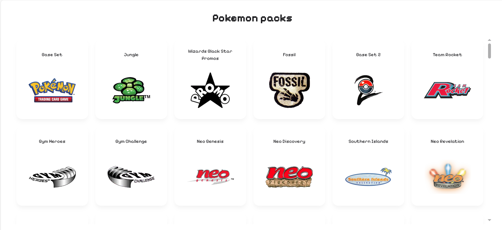

# Pokémon Cards & Sets — Dictionary + Pack Open Simulator

## Overview

This project is a lightweight **single-page** HTML/JavaScript app combining a **card dictionary** and a **pack open simulator** for Pokémon TCG collectors and players. The app runs entirely in the browser (no build step required) and allows users to:

- Browse a dictionary of individual cards with an interactive **3D card view**.
- Browse sets with set-level metadata and included cards.
- Simulate opening booster packs with a **smooth, 3D pack-open animation** and collectible animation effects (card glance).

> **Note:** This app does **not** contain pricing or marketplace data.

---

## Screenshots / Mockups

Add screenshots or mockups here when available.

- Set dictionary UI

- Card dictionary UI

- Pack open simulator

## Tech Stack
**Technologies used:**
* **HTML** — structure and layout for the entire single-page app.
* **JavaScript** — handles all interactivity, card logic, and pack simulation.
* **CSS** — core styles and animations.
* **Tailwind CSS** — utility-first styling for responsive and clean UI design.
* **DaisyUI** — component library built on Tailwind for consistent theming and ready-to-use UI elements.
* **Lightbox.js** — provides modal-style image previews for card artwork and set details.
* **TCGdex SDK** — for fetching official Pokémon TCG card and set data dynamically.

## TCG API
Special thanks to [TCGdex](https://tcgdex.dev/) for the API to powered this application!

## Getting Started (local)

1. Clone the repo or download the ZIP.
2. Open `index.html` in a modern browser (Chrome, Firefox, Edge).
3. Optionally run a tiny static server for CORS-friendly image loads: `npx http-server` or `python -m http.server`.

